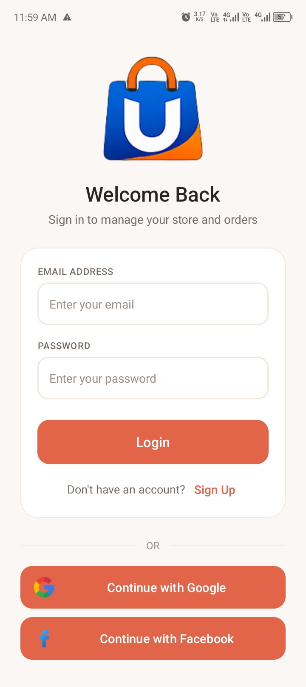
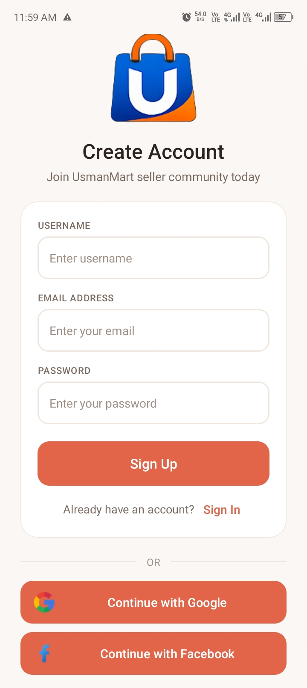
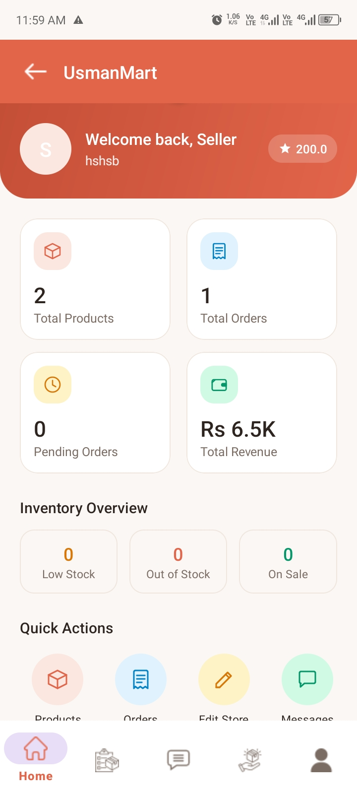
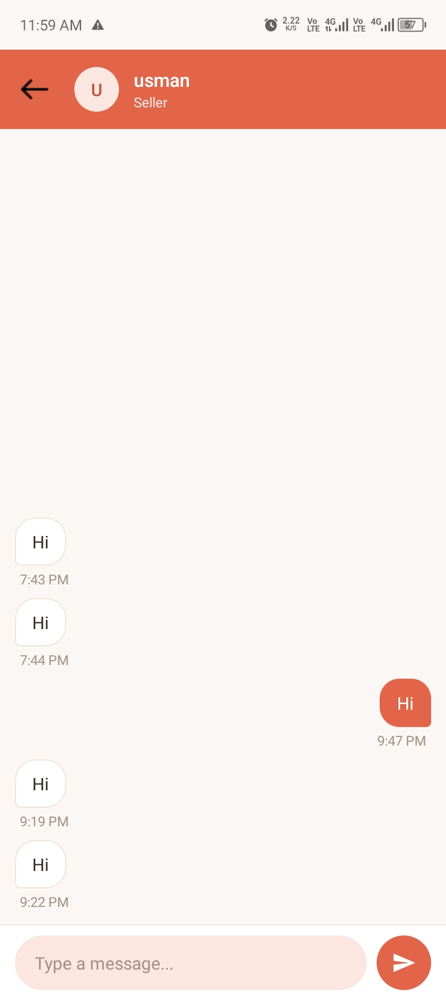
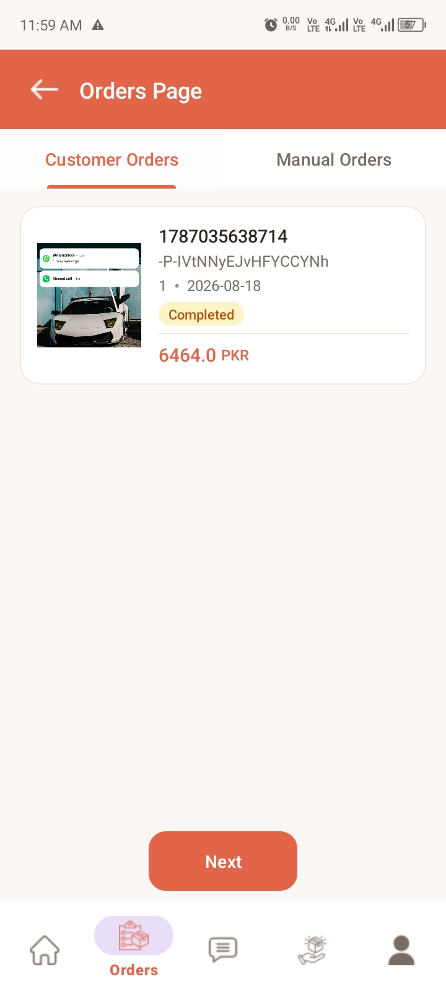
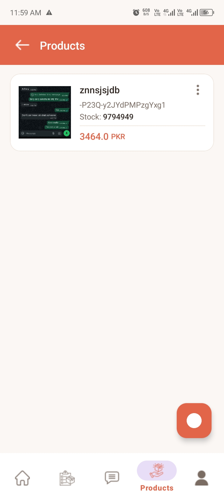
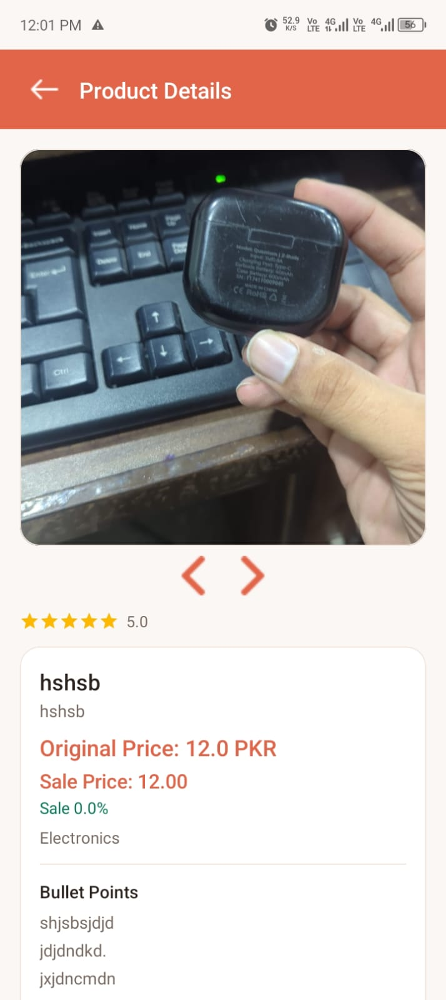
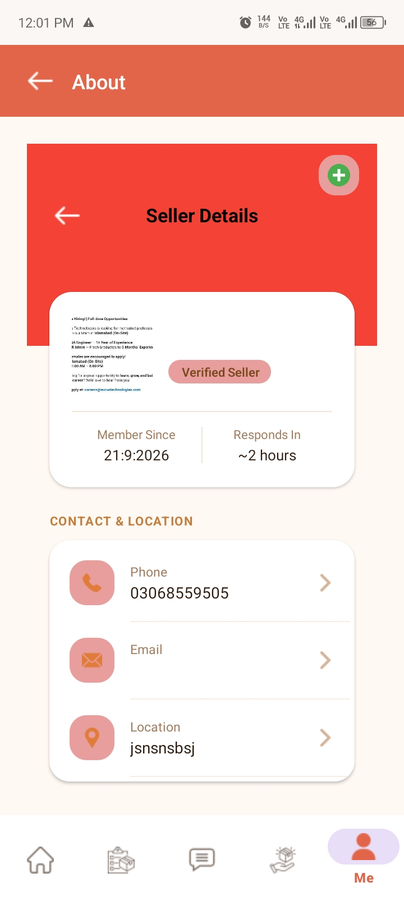

# UsmanMart - Seller Portal & Store Management Application

A modern, native Android seller management platform designed for e-commerce vendors to establish storefronts, manage product catalogs, track orders, run promotional sales, and communicate directly with buyers in real time.

> **Developer Credit**: Developed solo by **M. Usman Ali** ([@usmana6072](https://github.com/usmana6072) / TechTitans).

---

## Overview

**UsmanMart** solves the challenge faced by independent vendors and small-to-medium marketplace sellers who need a unified, mobile-first dashboard to operate their businesses on the go.

The application serves as the merchant portal in the UsmanMart e-commerce ecosystem, enabling sellers to:
* Set up a verified seller profile and digital store in minutes.
* Track real-time sales metrics (revenue, total orders, pending orders, and active inventory).
* Create and update product listings with multi-image cloud uploads and bullet-point specifications.
* Manage customer order lifecycles and record offline manual sales.
* Communicate with buyers via integrated 1-on-1 real-time messaging with push notifications.

---

## Features

### 🏪 Store Setup & Onboarding
* **Merchant Registration**: Email/Password and Google Sign-In via Credential Manager API.
* **Store Creation Workflow**: Configure store title, category, seller phone, address, and upload high-resolution store logos and banners.
* **Admin Verification Banner**: Notice banner indicating admin store approval status.

### 📊 Real-Time Analytics Dashboard
* **Sales Metrics Overview**: Real-time counter cards for Total Products, Total Orders, Pending Orders, and Total Revenue in PKR.
* **Inventory Overview**: Quick status chips for Low Stock, Out of Stock, and On Sale items.
* **Quick Action Shortcuts**: One-tap access to Products, Orders, Store Settings, and Buyer Messages.
* **Recent Orders Feed**: Compact summary card list of latest transactions.

### 📦 Product & Inventory Management
* **Catalog Management**: View, search, and manage product inventories with ID, stock level, price, and image previews.
* **Multi-Image Cloud Upload**: Upload up to 6 product images per listing with Cloudinary cloud storage and built-in image cropping.
* **Rich Product Specifications**: Bullet points, long-form descriptions, category classifications, and search tags.
* **Product Details View**: Multi-image slider, rating bar, review feedback list, and category details.
* **Promotional Sales Creator**: Set custom sale prices, discount percentages, and sale end dates.

### 📋 Order Management & Manual Sales
* **Dual Order Navigation**: ViewPager2 tabbed navigation for Customer Orders and Manual Offline Sales.
* **Manual Sales Entry**: Form to log direct offline sales against catalog products.
* **Order Processing**: Detail view with buyer info, shipping address, date/time, price, and status pills (Pending, Shipped, Completed).

### 💬 Real-Time Buyer Direct Messaging
* **Conversations List**: Displays buyer avatar/initial, buyer name, last message snippet, and formatted timestamp.
* **Live Chat**: 1-on-1 messaging with real-time Firebase Realtime Database synchronization.
* **Timestamp Formatting**: Formatted message timestamps (`10:20 AM`, `3:45 PM`).
* **Push Notifications**: Integrated Firebase Cloud Messaging (FCM v1) notifications sent automatically on new messages.

### ⚡ Session Performance
* **Instant App Launch (0ms)**: Local `SharedPreferences` session caching bypasses unnecessary network checks on launch for returning logged-in users.

---

## Screenshots

### Authentication & Dashboard

| Login Screen | Registration | Dashboard |
| :---: | :---: | :---: |
|  |  |  |

### Products & Inventory

| Product Catalog | Add Product Form |
| :---: | :---: |
|  |  |

### Orders & Real-Time Messaging

| Orders Overview | Messages List | Real-Time Chat |
| :---: | :---: | :---: |
|  |  |  |

---

## Tech Stack

| Technology / Library | Version / Tool | Purpose |
| :--- | :--- | :--- |
| **Java** | OpenJDK 17 | Primary application programming language |
| **Android SDK** | minSdk 33, targetSdk 36 | Android platform development |
| **Material Components** | Material 3 (`com.google.android.material`) | Modern UI components, cards, navigation, and input fields |
| **ViewBinding** | Android Gradle Plugin Feature | Type-safe view binding for layout XMLs |
| **Firebase Auth** | 23.x / Credential Manager | User authentication (Email/Password & Google Sign-In) |
| **Firebase Realtime Database** | 21.x | Real-time chat messages, seller accounts, and store nodes |
| **Firebase Firestore** | 25.x | Document database for products and order records |
| **Firebase Messaging (FCM)** | 24.x | Push notification delivery |
| **Cloudinary Android SDK** | 3.0.2 | Cloud media hosting for store logos, banners, and product photos |
| **Picasso** | 2.8 | Image loading, resizing, and memory caching |
| **ImagePicker** | 2.3.22 | Image selection and freestyle image cropping |
| **CircleImageView** | 3.1.0 | Circular avatar views |
| **Retrofit 2 & Gson** | 2.9.0 | REST API client for FCM HTTP v1 notification requests |
| **SwipeRefreshLayout** | 1.2.0 | Pull-to-refresh interactions across lists |

---

## Architecture

The project follows a component-based Android architecture utilizing Activity/Fragment UI controllers, ViewBinding, Data Models, custom RecyclerView Adapters, and asynchronous Firebase/Cloudinary service integrations.

```
┌─────────────────────────────────────────────────────────┐
│                    Presentation Layer                   │
│   (Activities, Fragments, Adapters, Material 3 Views)   │
└────────────────────────────┬────────────────────────────┘
                             │ (ViewBinding / Events)
┌────────────────────────────▼────────────────────────────┐
│                      Data & Services                    │
│  - Firebase Auth & Google Credential Manager            │
│  - Firebase Realtime DB & Firestore                     │
│  - Cloudinary Media Manager (Unsigned/Signed Uploads)  │
│  - Retrofit FCM Push Notification Service               │
│  - SharedPreferences Local Session Cache                │
└─────────────────────────────────────────────────────────┘
```

### Key Components & Responsibilities
* **Activities & Fragments (`com.techtitans.usman.usmanmart`)**:
  * `SignInActivity` / `SignUpActivity`: Handles user authentication and session caching.
  * `MainActivity`: Main container with BottomNavigationView managing `HomeFragment`, `OrderFragment`, `MessageFragment`, `ProductsFragment`, and `AboutFragment`.
  * `AddProductActivity` / `EditProductActivity`: Multi-image Cloudinary upload and product form handlers.
  * `ChatActivity`: Real-time 1-on-1 direct chat interface.
  * `StoreFormActivity`: Seller store creation and initial setup.
* **Data Models (`com.techtitans.usman.usmanmart.models`)**:
  * `SellerModel`, `StoreModel`, `Product`, `OrderModel`, `MessageModel`, `ReviewModel`.
* **Adapters (`com.techtitans.usman.usmanmart.recyclerViewAdapters`)**:
  * `ProductAdapterProductsPage`, `RecentOrdersAdapter`, `OrderAdapterOrderPage`, `ChatItemAdapter`, `ChatDetailsAdapter`, `ReviewAdapter`.
* **Services & Helpers (`com.techtitans.usman.usmanmart.helperclasses` / `services`)**:
  * `MyFirebaseMessagingService`: Background push notification listener.
  * `FcmAccessTokenManager`: Google OAuth2 token retrieval for FCM v1 push messaging.

---

## Project Structure

```text
UsmanMart/
├── app/
│   ├── build.gradle
│   └── src/
│       └── main/
│           ├── AndroidManifest.xml
│           ├── java/com/techtitans/usman/usmanmart/
│           │   ├── ChatActivity.java
│           │   ├── CreateSaleActivity.java
│           │   ├── EditSellerDetails.java
│           │   ├── MainActivity.java
│           │   ├── OrderDetailsActivity.java
│           │   ├── ProductDetailsActivity.java
│           │   ├── SignInActivity.java
│           │   ├── SignUpActivity.java
│           │   ├── forms/
│           │   │   ├── AddProductActivity.java
│           │   │   ├── EditProductActivity.java
│           │   │   ├── OrderCreateForm.java
│           │   │   └── StoreFormActivity.java
│           │   ├── fragments/
│           │   │   ├── AboutFragment.java
│           │   │   ├── CustomerOrderFragment.java
│           │   │   ├── HomeFragment.java
│           │   │   ├── ManualOrdersFragment.java
│           │   │   ├── MessageFragment.java
│           │   │   ├── OrderFragment.java
│           │   │   └── ProductsFragment.java
│           │   ├── helperclasses/
│           │   │   ├── FcmAccessTokenManager.java
│           │   │   └── NotificationSender.java
│           │   ├── interfaces/
│           │   │   └── ApiService.java
│           │   ├── models/
│           │   │   ├── BuyerModel.java
│           │   │   ├── MessageModel.java
│           │   │   ├── OrderModel.java
│           │   │   ├── Product.java
│           │   │   ├── ReviewModel.java
│           │   │   ├── SellerModel.java
│           │   │   └── StoreModel.java
│           │   ├── recyclerViewAdapters/
│           │   │   ├── ChatDetailsAdapter.java
│           │   │   ├── ChatItemAdapter.java
│           │   │   ├── OrderAdapterOrderPage.java
│           │   │   ├── ProductAdapterProductsPage.java
│           │   │   ├── RecentOrdersAdapter.java
│           │   │   └── ReviewAdapter.java
│           │   └── services/
│           │       └── MyFirebaseMessagingService.java
│           └── res/
│               ├── drawable/
│               ├── layout/
│               ├── menu/
│               └── values/
├── screenshots/
│   ├── add_product_screen.jpeg
│   ├── chat_details_screen.jpeg
│   ├── dashboard_screen.jpeg
│   ├── messages_screen.jpeg
│   ├── orders_screen.jpeg
│   ├── products_screen.jpeg
│   ├── signin_screen.jpeg
│   └── signup_screen.jpeg
├── COLOR_SYSTEM.md
├── build.gradle
└── settings.gradle
```

---

## Getting Started & Build Instructions

### Prerequisites
* **Android Studio**: Jellyfish | Ladybug | 2024.1+
* **JDK**: OpenJDK 17
* **Android SDK**: API Level 33 (min) / API Level 36 (target)
* **Firebase Project**: Connected with Authentication, Realtime Database, Firestore, and FCM enabled.

### Building the Project
1. Clone the repository:
   ```bash
   git clone https://github.com/usmana6072/UsmanMart.git
   cd UsmanMart
   ```
2. Place your `google-services.json` file inside the `app/` directory.
3. Build the APK using Gradle:
   ```bash
   ./gradlew app:assembleDebug
   ```

---

## Author & Acknowledgments

* **Lead Developer**: M. Usman Ali ([@usmana6072](https://github.com/usmana6072))
* **Organization / Team**: TechTitans
